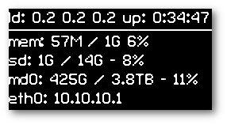
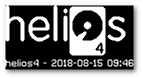

# Description
Application to display Helios4 system status for i2c OLED screen.




* Based on [luma.oled](https://github.com/rm-hull/luma.oled)
* Inspired from luma.oled [sys_info.py](https://github.com/rm-hull/luma.examples/blob/master/examples/sys_info.py) example

## INSTALLATION

```
git clone https://github.com/helios-4/sys-oled.git
cd sys-oled
sudo ./install.sh
```

## CONFIGURATION

### Configure OLED display model

1. Test which display model is the correct one by launching manually **sys-oled** and trying different display model as parameter.
Example :

```
sudo sys-oled --display ssd1306
sudo sys-oled --display sh1106

```

Supported values : ssd1306 (default), ssd1322, ssd1325, ssd1327, ssd1331, ssd1351, sh1106.

2. Once you know which display model is the correct one, edit */etc/sys-oled.conf* and update the **DISPLAY=** line.


### Configure storage info

For now **sys-oled** is a very crude python app that will require you to edit it directly in order to customize what you want to display.

Edit **sys-oled** script and look for the *status()* function.

```
sudo nano /usr/local/bin/sys-oled
```

You can edit the following lines to define for which storage devices you want to display info.

```
d.text((0, 27), disk_usage('sd', '/'), font=font, fill="white")
d.text((0, 39), disk_usage('md0', '/mnt/md0'), font=font, fill="white")
```

In the above example, we are displaying **sd** (SDcard) usage which is the rootfs mounted on *'/'*. We are also displaying **md0** (RAID array) that is mounted on *'/mnt/mnd0'*.
The values *(0, 27)* and *(0, 39)* correspond to the X, Y positions of displayed texts.

### Start the service

The install script will automatically setup **sys-oled** to start at every startup. Now you can either restart your Helios4 or you can launch directly the service with the following command:

```
systemctl start sys-oled.service
```

## Note

This sys-oled app was developed and tested only with the OLED model SH1106 which has a matrix panel of 132 x 64. If you use a different model that has a smaller resolution, you might need to tweak the coordinate values.
